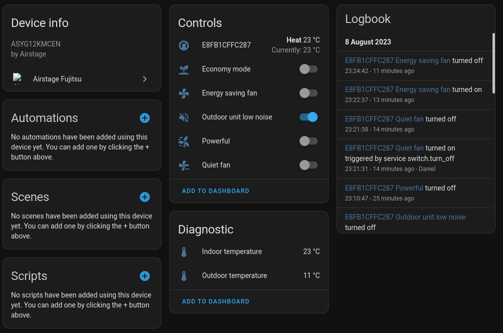
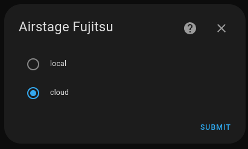
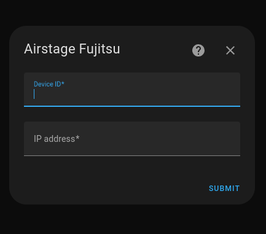
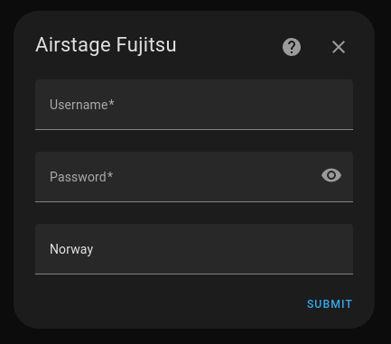

# Airstage Home Assistant component

Connects your Fujitsu Airstage air conditioner to Home Assistant.

## Installation

### HACS Installation

1. Open HACS
2. Select Integrations, then select the 3-dots in the upper-right corner, then select Custom Repositories.
3. Put the Reposity URL in the Repository field, then select Integration in the Category dropdown list and click Add.
4. Now you can search for Airstage in HACS and install it
5. After the installation you need to restart Home Assistent
6. Now you can skip Configuration and proceed with Usage

### Custom components

1. Download or clone the ha_airstage Integration to your local machine.
2. Navigate to the custom_components directory in your Home Assistant installation directory.
3. Copy the folder custom_components/fujitsu_airstage from the downloaded ha_airstage Integration to the Home Assistant custom_components directory.
5. Restart Home Assistant.

## Configuration

After install go to "Add integration" and search after Fujitsu Airstage.

### Control modes

There are two ways to connect to your Airstage devices

- Local (recommended)
- Cloud

#### Local

To add a local device you need the IP Address and Device ID. On my device the MAC address was stated so it was easy to find the IP address on my local network.
The device id is the same as the MAC address exept the ":". Or you can scan the wifi SSID and remove the "AP-WH3X-" the device id is the last 12 characters.

#### Cloud

WARING: while writing this code and testing against the Airstage rest api I was locked out from the service. They blocked my public IP from using the api (which effects also the mobile app). The local environment still works, but the app want you to change wifi to the local hot-spot on the device, which sucks. The local mode on this integration still work even my public ip is blocked.

You need your email and password used on the Airstage app. Also you need your country, my case it was Norway. Will add all your Airstage devices connected to the account.

